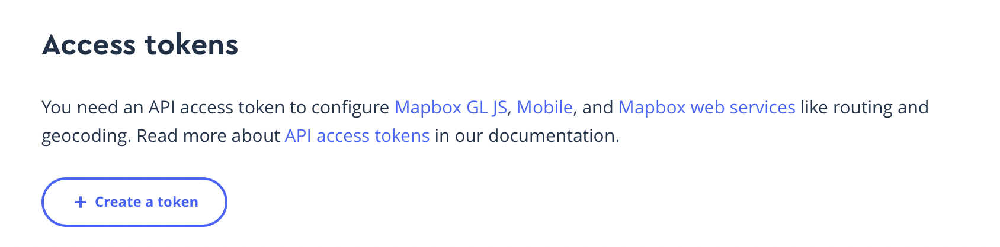

# bike_nav

## Disclaimer

Aktuell nur auf Android Lauffähig

## Heuristischer Test

Entwickler Anfragen für eine APK.

## Setup

Anmelden auf [Mapbox](https://account.mapbox.com/). Danach zur account page gehen und einen neuen Access-Token erstellen.

Dabei ist es wichtig DOWNLOADS:READ auszuwählen. Danach hast du beide Token verfügbar. Der Geheime beginnt mit sk. und der öffentlihe mit pk.

Die Seite ersteinmal nicht verlassen, da sonst der geheime Schlüssel nicht mehr abrufbar wird.

Git repository herunterladen und folgende Dateien hinzufügen

    /android/gradle.properties 

    MAPBOX_DOWNLOADS_TOKEN=DEIN_PRIVATER_SCHLÜSSEL (der private Schlüssel startet mit sk.)

    /android/app/src/main/res/values/strings.xml

    <?xml version="1.0" encoding="utf-8"?>
    <resources>
        <string name="app_name">Navigation map</string>
        <string name="mapbox_access_token" translatable="false">DEIN_ÖFFENTLICHER_SCHLÜSSEL</string>
        <string name="user_location_permission_explanation">This app needs location permissions to show its functionality.</string>
        <string name="user_location_permission_not_granted">You didn\'t grant location permissions.</string>
    </resources>

    /assets/config/.env

    MAPBOX_ACCESS_TOKEN="DEIN_ÖFFENTLICHER_SCHLÜSSEL"

Danach in gewohnter Manier nicht `flutter pub get` vergessen und dann `flutter run` ausführen. Wichtig dabei ist wie gesagt, dass ein Android Handy oder ein entsprechender Emulator angebunden ist.

Bei Fragen meldet euch bitte bei Theo oder Joshua